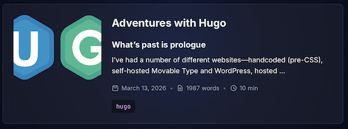

+++
date = '2026-03-16'
draft = false
title = 'Adventures with Hugo'
tags = ['hugo','obsidian','zed','markdown','github']
image = 'hugo-logo-wide.svg'
author = 'KD3CPY'
+++
# Introduction

I've had a number of different websites---handcoded (pre-CSS), self-hosted Movable Type and WordPress, hosted WordPress, idle play with Drupal, handcoded (with CSS) in a recent spate of nostalgia, etc.---and decided I'd try a static site generator. It's been a while since I've Learned A New Skill, and I guess I was in need of a new distraction/hyperfocus. 

Well. "Need" is perhaps a strong word.

Especially since the impetus for a new website is tied up with ham radio, another New Skill that I am Learning. So, yeah, let's just move this entirely into the procrastination column.

I spent comparatively little time comparing things like Jekyll, 11ty, and Hugo. They seemed...fine, probably, and definitely overkill for my needs. I came across some sites actually using Hugo and decided I liked a couple of the templates. Since deciding to go with it, some folks online and in person have given it a thumbs up.
# Catch up

It's been close to twenty years since I've used the command line. I used to do a lot with SQL databases, plus telnet or ssh to tweak websites, pine and elm for email, etc., but it's been a while since I've done any of that. I can't remember when I last moved between directories without clicking on an icon.

So the first thing I had to do was figure out where Apple puts the Terminal. (Spoiler alert: It's grouped with the Other Apps. This is my first Mac since...well, since before Steve Jobs's cancer diagnosis.) After that, it was like riding a bike, except instead of keeping my balance and pointing the front wheel in the right direction I was mostly pasting in commands or googling how to `rmdir` a directory with files and subdirectories in it. And it turns out I somehow have the muscle memory of the `pico` command to do a quick file review. (I was surprised.) I've encountered some very good documentation and have made use of [Homebrew](https://brew.sh) and [GitHub](https://github.com).  
# Quick start

The Hugo folks have an easy, nicely-documented [quick start](https://gohugo.io/getting-started/quick-start/) procedure. It worked like a charm (the only bobble is a broken image in the default theme, Ananke). It's a good way to get your feet wet with the command line (I was comfortable, albeit rusty; but even if you come in with zero prior experience, it's straightforward). And then you've got a site to play around with.
# Markdown

I'm not a fan of Markdown. This is mainly because I learned HTML back in the '90s and had a pretty easy time remembering tags and special character codes and whatnot. Using a single asterisk or underscore isn't any easier to remember than putting an i or em in angle brackets, is it? Markdown just felt like the [fifteenth standard](https://xkcd.com/927/).

But it is 2026, Markdown is old enough to drink, and my philosophical curmudgeonliness doesn't actually make it any harder to use.
# Editing

I did some quick googling and installed [Obsidian](https://obsidian.md). People seem to like it and it doesn't seem to use AI by default. (My feelings about so-called AI may be the subject of a future rant. But for the moment, suffice to say that I avoid AI tools and view them and their advocates with great suspicion.)

Anyway, I got Obsidian set up quickly and it seemed fine. It renders HTML correctly, so in that respect it does not accurately represent what Hugo will display. I can see the vault set up being very useful, even though I'm basically just treating Obsidian as a generic text editor.

The second theme I tried required plunking a lot in the `hugo.toml` file. Brief confusion about the file's absence in my vault lead to TSOR, where I learned that Obsidian just doesn't do `.toml`. After some eye-rolling and another TSOR, I found a couple candidates that did.

So now I have [Zed](https://zed.dev) installed. It's happy editing `.toml` as well as `.md` files. I changed the theme to get those nice, sandy gruvbox pastels and a bit of visual distinction from the Obsidian vault. The Zed folks, like the Obsidian folks, seem to be under the impression that I want to enable input from the planet-destroying plagiarism machines. (What's the Markdown code for "heavy, world-weary sigh, with just a hint of contempt and an intimation of rolling eyes"?)

I didn't have time to get attached to Obsidian, but I haven't uninstalled it. Obsidian and Zed each have a differently loose interpretation of WYSIWYG (Obsidian shows three dashes but Zed renders an em-dash; Obsidian renders italics but Zed shows the asterisk and changes the color), but since I started using them the same day neither of them seems *wrong*. At the moment, I'm using Obsidian for `.md` and Zed mostly for `.toml` and `.css`. 
# Themes

I wasted much time looking at different themes before I set about using Hugo. My time was much better spent actually mucking about with them. (I am familiar enough with theme rumination to know that's always how it goes.)

Hugo's layout has recently been rejiggered. There is advice on how to deal with this (altering naming conventions, running previous releases of Hugo, updating submodules, etc.); the Ananke theme repository includes warnings and discussion of issues. The changes apparently came as part of a November 2025 release. It's good to know project inflection points that can become pain points, and it informed my decision to look at newer themes (although not before trying my initial favored theme).
## Ananke

The quick start uses the [Ananke](https://github.com/theNewDynamic/gohugo-theme-ananke) theme, which is a bog-standard header-image-over-text-column. The image doesn't load (I suspect it's an easy fix) and I'm not terribly fond of the aggressive vanilla-ness. The purpose of this theme is to have a base to customize. (I mean, that's what you do with any theme, but moreso with this one.) I may well come back to it if I want to spend time building a theme, but right now I don't.

Ananke's apparently in maintenance mode, with no plans for new features. That's actually fine---nothing wrong with something basic and stable---but one of the things I'd like out of the box is light/dark mode, so no dice here.

But, despite only using it to test basic functionality, it's still solid. And the name had the side effect of reminding me of Vinge's *The Summer Queen*, so that's fun.
## Gruvbox

The theme I initially liked was [Gruvbox](https://github.com/schnerring/hugo-theme-gruvbox/tree/main). Going in, I didn't actually know what "gruvbox" referred to, but I do remember basic web design advice about contrast. Pastel background, black or near-black text for readability. Or the reverse, for the folks who like dark mode. (I don't, typically, but a built-in light/dark toggle seems like a nice option for accessibility.) I'm not the target user of this theme---I won't be publishing big blocks of code and I have negative interest in posting a resume---but hey, nice color palette and responsiveness.

Gruvbox required installing more than the bare minimum of Hugo and Git (including the extended version of Hugo, Go, llvm, n, etc.) and I did several rounds of tracking down what I needed, installing it, and seeing what happened. What happened was watching errors getting thrown, lists of security vulnerabities, and forced fixes that caused breaking changes. It did encourage me to read more issue notes and I now feel like I've got a better sense of recent changes to Hugo (as well as the scope of dependencies in a theme I like largely for the color scheme). I also felt better about embracing the philosophy that a theme is meant to enable laziness. Do I want to spend time fixing something that is broken or build something myself? No, not particularly. 

Note that this use case of "broken" does include "user error"---it's quite possible I'm missing something obvious---but for my use case, there's no reason to spend more time overcoming barriers to spinning it up.
## Mana

[Mana](https://github.com/Livour/hugo-mana-theme/tree/main) is a bit less aesthetically appealing than Gruvbox (I like that sandy color scheme), but it has a) light/dark mode and b) avoids strict white and black. I do like some of Mana's subtle grace notes, the drop shadows and glass effects, which I'd never both to do myself. I have negative interest in tip jar integration and don't need multilingual support (I am, alas, a monolingual American). This theme feels heavy, with boxes and whatnot, and I'm meh on some of the fonts. (In my mind, Courier = manuscript, not a finished product. And pretty much everybody's moved away from Courier for manuscripts.) I don't care too much about the design being "mobile first"---I do not have an audience in mind, much less a heavily-mobile audience---except insofar as it implies responsiveness. I do like responsive design.

On the plus side, it's less than a month old (that makes it newer than Hugo's layout rejiggering). On the negative side, it's less than a month old (not much time for tire-kicking). One developer adds to the crapshoot factor. But whatever, it's a website theme; if it doesn't work, I can swap it out. It's different from what I use elsewhere, and that's very appealing.

Looking at this theme got me googling Catppuccin and Chroma (oh, look, there's gruvbox again), and reflecting that it's nice that there are designers doing their design thing. I have *opinions* on colors, and I could probably come up with non-horrible palettes, but I'd much rather take the advice of people with a trained eye.

I followed the [quick start](https://gohugo.io/getting-started/quick-start/) procedure again, substituting Mana for Ananke, and then started editing the `hugo.toml` file. Very quick and smooth. I started writing this as a test post.
### Tweaks

By default, the copyright displays in the footer, and in the `hugo.toml` you can set the start year. It then displays a range, the start year parameter through the current year: so as of March 2026, it'll display 2026-2026. I have no idea where the current year comes from, but I don't need to care. (Ah, found it: `themes/mana/layouts/partials/footer.html`. Still don't need to care. Well, okay, I care enough to code in an en-dash.) Commenting out that start year line in `hugo.toml` gets rid of the duplicate year, and in January I can just uncomment it and never think about it again.

The post Year & Month filter displays March 1, 2026, not March 2026. I haven't bothered digging into that yet. It's pretty clear what it means and the superfluous day doesn't impact functionality, so it's not high on my prettifying punchlist.

The theme's default social media list does not overlap with *my* default social media list. I've just disabled the social menu for now; those links can live on the About page. I don't even have that many callsign-related profiles---[Mastodon](https://mastodon.radio/@KD3CPY), [Bluesky](https://bsky.app/profile/kd3cpy.bsky.social), and [GitHub](https://github.com/KD3CPY)---and if I start using the social menu (or hard-coding it somewhere), I'll probably only add Mastodon, or maybe ham-specific things like QRZ or Logbook of the World.

The Buy Me a Coffee doohickey is disabled by default, saving ten seconds of my life. There are sites where I sell things and/or accept donations, but I'm not going to do so on this particular hobby site.

I may rejigger fonts, but that's for later. I don't want to mess around too much with styles right now. I even left the default Catppuccin selections in place. (I do like the purple.) I can't see much daylight between h1, h2, and h3 based on eyeballing this post. I also can't bring myself to care too much, especially since the Table of Contents nests them correctly. (Speaking of overkill for my use case. My past blogging has rarely involved significant use of headers.) I might see if I can selectively disable the TOC for posts without headers, since it just becomes a waste of space, but that is not a priority.

I am not a fan of bouncing images, so the animated hero image was on my hit list. (One person's feature is another person's bug.) It also wasn't a very high priority, but when I was looking through the `.css` files for other reasons, I found the `hero.css` in `themes/mana/assets` and commented out two lines of code for the animation. I might rejigger the hero section in general, but now that it will hold still I'm fine plunking in an image.

Motivated by nostalgia and annoyance with some trends of the modern web, I've enjoyed the renaissance of webrings. I decided mine would live on my About page. I modified `themes/mana/layouts/about/single.html` by plunking in the webring `<nav>` code, but then decided if it was going to be in the body of the page I'd just Markdownify it. 
# Where do the images go?

In the previous millennium, I would routinely create a single directory for images. So much neater than just having them hanging around loose. And the next time you needed an image, you knew where it was.

So...would an image file belong in content or asset or static? Unsurprisingly, the queries and discussion seem to indicate that the actual answer is "it depends" (I respect that), but the [content management documentation](https://gohugo.io/content-management/) talks about page bundles and resources. I take that to mean that the preferred organizational method is to have directories for each post, within which there's an `index.md` and image files (and whatever else the post needs). That strikes me as a bit bulky, if you ever reuse images or other resources, but it seems like the way to get into the spirit of Hugo.

So for this post, I went with `content/posts/hugo` as the file path. In there is the logo (`hugo-logo-wide.svg`) and the actual post (`index.md`). 

I've established how to provide alt text for an image within the body of the post: 

```markdown

```

And with that Markdown sample, I have now also established that the light/dark toggle doesn't effect code blocks. I suspect I could figure out how to reconfigure it, but it's not at all a priority for me. If I was planning on displaying lots of code, it would merit a deeper dive.

I haven't yet made any tweaks to assign alt text to images included in the frontmatter of posts: it looks eminently do-able, but is not a priority because those will probably just be decorative images. And it's possible I'll opt out of using them entirely, because without resizing them for card display they're potentially just a random splash of color. In any case, making changes to adjust the frontmatter images will count as more active mucking about than I want to do at the moment.


And before I look into alt text, I'd have to deal with sizing. I tried a 120 x 240 image, and the theme blew it way up to fill the width at the top of the post. Again, presumably I can figure out how to get the sort of responsiveness I want, but the much easier solution is to just...not call images in the frontmatter.

Getting the images on the About page and hero section was frustrating. They're called in `hugo.toml` (`params.avatar`). I tried setting the About avatar `assetPath` to an image in the `about` directory and for the hero image, I tried creating an `images` directory in `static`, in `content`, in `public`. No dice. I looked at the `example.toml` in the theme directory (not for the first time!)...and saw the option to just set a `url` instead of `assetPath`. I set the damn `url` for the hero image and called it a day. Voilà, enjoy the extremely yellow [international symbol for amateur radio](/images/International_amateur_radio_symbol-240x480.png) on the landing page.

I tried the same process for the About page...and it's broken. I tried to enable resizing...nope. (Maybe because `url` is set?) Argh. I tried yoinking the image off the theme-maker's page, in case using 120 x 240 was an issue. Nope, still not displaying. I'm not sure what's going on, why the same solution doesn't work for this avatar. I'm sure there's something obvious I'm missing (like when you walk past the thing you want at the grocery store half a dozen times, only to find it sitting at eye level). I solved the problem by commenting out a line of code in the `hugo.toml` file. I didn't have any avatar I was particularly excited about using anyway.

And I also realized the header text announcing ABOUT was missing...even though other stuff called in the `.css`, like the site description, was present. That was me not setting the frontmatter. That is a "me" problem. I'm clearly still conceiving of all Markdown being page content, not metadata. 
# Hosting and deployment

Now I've got a site. Where to put it?

I'm using the extended/deploy version of Hugo, specifically 0.157.0, but apparently the "deploy" part only applies to a few cloud services. Alas. I do not feel like fiddling around with their various plans when I'm just looking for free hosting. I don't need to care about uptime---this is purely a hobby site---and if I end up opting for a domain name, I can just point it wherever. 

I've been using Neocities lately, when I need something quick-and-dirty and I've seen at least one [guide](https://neonaut.neocities.org/neocities/) for slapping a Hugo site up there. I also see advocates for GitHub Pages. The Hugo documentation includes a lot of hosting options. Most of them seem to involve having a GitHub repository in the first place. So if the assumption is that I'm already using GitHub, it seems like I might as well use GitHub Pages. (I don't think I need to care about the repository being public.) So my current plan is to try that by following the Hugo [documentation](https://gohugo.io/host-and-deploy/host-on-github-pages/). It's served me well so far.
