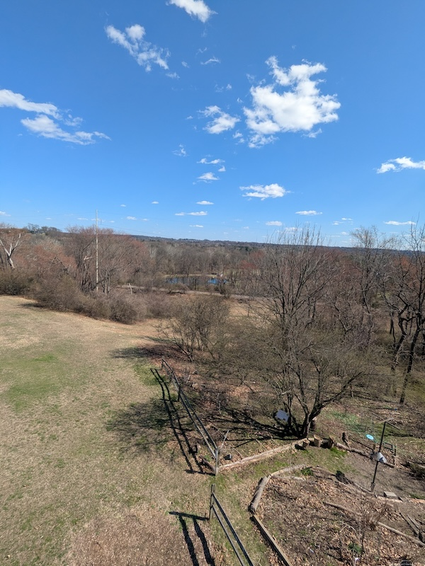

+++
date = '2026-04-03'
draft = false
title = 'Spring POTA Fest'
tags = ['ham radio','amateur radio','POTA','POTAMANIA','Spring POTA Fest','PMRC','Fort Washington State Park']
image = 'pota-banner.jpg'
author = 'KD3CPY'
+++

## Touching grass
The Phil-Mont Mobile Radio Club does Parks on the Air throughout the year, but the last weekend in March was the Spring POTA Fest at Fort Washington State Park (US-1352). Though I've lived in the area for a few years, I had yet to visit the park and this seemed like the perfect opportunity. I needed to touch grass (even if the grass was mostly mud).

Last Saturday was a lovely day, brisk and sunny, and while I might've been a bit happier with a sweatshirt at least I got to demonstrate my resilience to chill temperatures. (Note that at no point did I consider camping. There is resilience while walking, greeting dogs, and socializing with humans...and then there is subjecting oneself to a miserable, sleepless night in a tent.)

If you find yourself in the park, the Militia Hill overlook gives a nice view of the creek, trees, train tracks, raptors (I didn't see any on Saturday, but it's specifically called the Hawk Watch and placards offer help identifying eagles, hawks, and turkey vultures), and the birds visiting feeders below (I saw many). I'm not a birder, but birds nonetheless make me happy.

## Acclimation
I did not *do* radio stuff, but I *listened* to radio stuff. Getting a sense of the sounds, rhythm of speech, stuff like that. Being cued into the fact that there was contesting going on during the weekend that might've horned in on potential POTA activities. Seeing antennas looped up in trees. Listening to CW in action. (I want to learn Morse code at some point—maybe I'll start next year—but hearing it come in I'm confident I could transcribe the pattern for translation, a first step before the practice and repetition necessary to do it at a more useful speed.)

I should probably be doing more direct hands-on stuff, but I'm also finding it useful to get a handle on the overall context. I'd probably feel differently if I had more of a background in anything ham-related; my natural imposter syndrome is bolstered by lack of comfort with standards and language. That sort of thing is best learned by osmosis. I won't absorb everything, but I'll get at least enough to know the general shape of what I know and what I don't.

So I am partway to checking off one of my 2026 goals. I won't count myself as having fully participated in POTA until I've actually hunted or activated.
